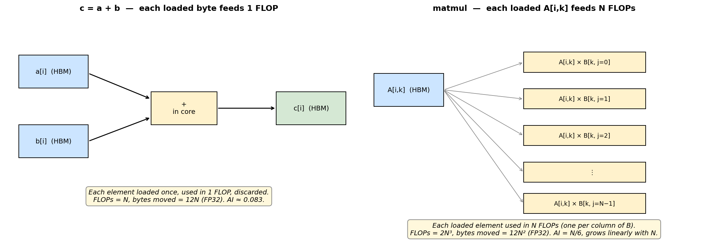
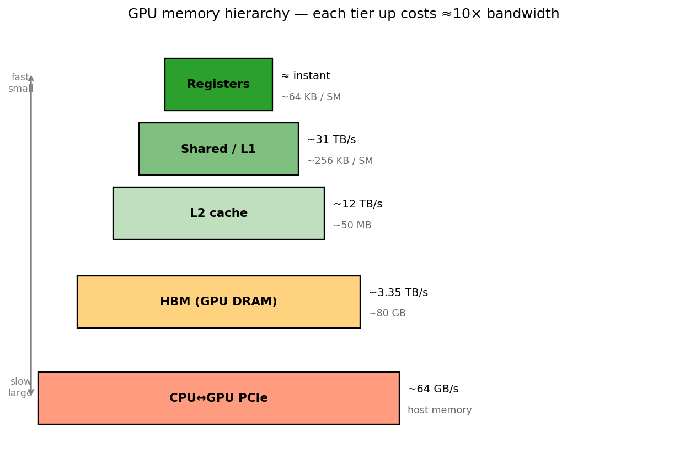
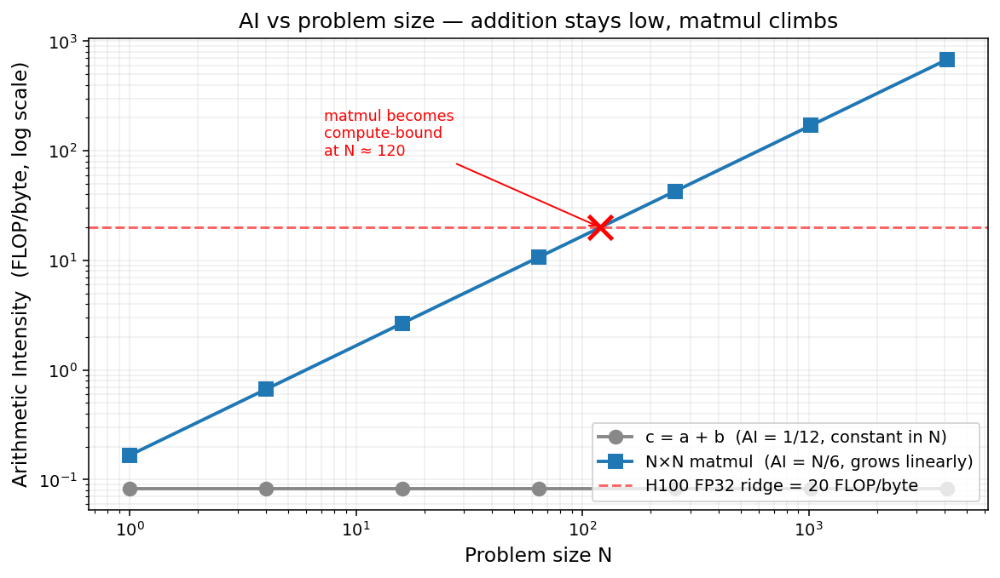
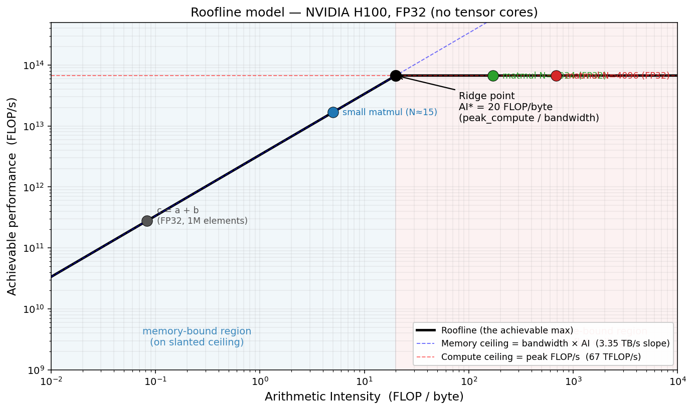

# Lecture Summary — GPU & Inference (aide-mémoire)

Two lectures: **L1 = GPU & Inference Intro** (13 May), **L2 = Inference Optimisations** (20 May). One-stop reference.

> If you're new to GPU performance: **read Part 0 below first.** It builds the vocabulary (FLOPs, bandwidth, arithmetic intensity, roofline, ridge point) that everything else assumes. The rest of the document is a dense aide-mémoire built on top of that foundation.

---

# Part 0 · Fundamentals (read this first)

Everything in the two lectures and in HW1 sits on top of five building blocks: **compute, bandwidth, bytes moved, loaded data, and work in flight.** They combine into **arithmetic intensity (AI)** and the **roofline model**, which is the analytical frame HW1 asks you to plot and reason about.

This section walks through each idea from the ground up with diagrams. If you understand it, the rest of the document is a quick reference; if you don't, the rest will feel like a list of unrelated facts.

## §0.1 Compute

"Compute" means **the GPU doing arithmetic on numbers** — adds, multiplies, multiply-adds. The unit is a **FLOP** = one floating-point operation:

- `a + b` → 1 FLOP
- `a * b` → 1 FLOP
- `a * b + c` (a **fused multiply-add**, FMA) → 2 FLOPs

"Floating point" just means the numbers can have decimal parts (3.14, −0.001). They're stored in formats like FP32 (4 bytes per number) or FP16 (2 bytes per number). The precision choice affects both byte count and how fast tensor cores can process the math.

**Compute speed** is FLOPs per second (FLOP/s). The H100 in FP32 is ~67 TFLOP/s — 67 trillion arithmetic operations per second. The numbers are huge because each Streaming Multiprocessor (SM) has many small arithmetic units, and an H100 has ~132 SMs running in parallel.

When the lecture says *"compute has grown 18×"*, this is the quantity it means: arithmetic ops/second.

## §0.2 Bandwidth

Bandwidth = **the speed at which data can be moved** from memory to the cores.

Pipe analogy:
- **Capacity** = how much water the pipe holds (H100 HBM = 80 GB).
- **Bandwidth** = how much water flows per second (H100 HBM = 3.35 TB/s).

These are different. The cores can do arithmetic far faster than HBM can deliver numbers to them — that asymmetry is the central tension in everything that follows. If your kernel doesn't have enough arithmetic per fetched number, the cores sit idle waiting for memory. This is what **"memory-bound"** means.

## §0.3 Bytes moved

Every computation reads inputs from HBM, does math, writes outputs back. "Bytes moved" = **the total amount of data that physically travels between HBM and the cores** during the computation.

Concrete example — `c = a + b` where `a, b, c` each hold 1 million FP32 numbers (4 MB each):

| Step | Bytes moved |
|---|---|
| Read `a` from HBM | 4 MB |
| Read `b` from HBM | 4 MB |
| Write `c` to HBM | 4 MB |
| **Total** | **12 MB** |

Total FLOPs done = 1 million (one addition per element).

## §0.4 Loaded data, and reuse

"Loading" = physically pulling a number from slow HBM into the cores' fast on-chip memory (registers, shared memory). Registers are essentially instantaneous; HBM is comparatively slow. So the game becomes: **once you've paid the cost of loading a number, do as much work with it as possible before discarding it.**

This is **reuse.** It is the single biggest lever you have on AI.



*Left: `c = a + b`. Each loaded byte feeds one FLOP, then is thrown away. Right: matmul. Each loaded element of A is multiplied against every column of B — one load, N FLOPs of useful work. Reuse grows linearly with N.*

**Kernel fusion** (what `torch.compile` does, and what HW1 explores directly) is a way to *increase reuse*. The arithmetic `y = (x * 2) + 1` in eager PyTorch is two kernels: load `x`, multiply, write back; load result, add, write back. **Four trips through HBM.** A fused kernel loads `x` once, multiplies and adds *in registers*, writes once. **Two trips.** Same arithmetic; half the bytes moved.

## §0.5 Memory latency and "work in flight"

Bandwidth and latency are different. **Latency** is how long any individual memory request takes to come back.

Highway analogy: a 16-lane highway has very high bandwidth (lots of cars per second pass any given point), but any one car still takes 30 minutes to drive across. HBM has high bandwidth but each individual access has latency in the hundreds of nanoseconds — many GPU clock cycles.

If a single core asked for a number and *waited*, it would sit idle for hundreds of cycles. Catastrophic.

The GPU's trick: instead of running a few fast threads, it runs **thousands** of threads, grouped into **warps** (32 threads each, running in lockstep). When warp A stalls waiting for memory, the SM scheduler **instantly switches** to warp B, which already has its data. Then C, then D. By the time we cycle back to A, its data has arrived.

This is **hiding memory latency with parallelism.** It only works if there's **enough work queued up** — meaning enough warps with independent work. Small kernels (tiny batch sizes, small tensors) don't expose enough parallelism, so the cores stall and the GPU goes idle. *This is why batch size matters so much in inference.*

## §0.6 Memory hierarchy

The GPU has tiers of memory with the classic trade-off: fast and small at the top, slow and large at the bottom.



**Rule of thumb:** every step up the pyramid costs ≈10× bandwidth. Host↔device transfers (CPU↔GPU over PCIe) are the slowest path of all — minimize them. "Reuse loaded data" really means: get work out of a number while it's high in the pyramid, before it has to be re-fetched.

## §0.7 Arithmetic intensity (AI)

Combining the previous ideas into one number:

```
AI  =  FLOPs performed  ÷  bytes moved          (units: FLOP/byte)
```

It is a property of the **algorithm** (and dtype), not the GPU. It tells you how much useful arithmetic each loaded byte buys you.

**Worked example — addition.** `c = a + b` on N FP32 elements: N FLOPs, 12N bytes. **AI = 1/12 ≈ 0.083 FLOP/byte.** Tiny. Constant in N.

**Worked example — matrix multiplication.** Multiplying two N×N FP32 matrices:

- *FLOPs.* Each output entry is a dot product: N multiplies + (N−1) adds ≈ 2N FLOPs. There are N² output entries. **Total: 2N³ FLOPs.**
- *Bytes.* Read A, read B, write C — each is N² FP32 elements at 4 bytes. **Total: 12N² bytes.**
- **AI = 2N³ / 12N² = N/6.** Grows linearly with N.

This is the most important non-obvious fact in HW1: **the AI of a matmul grows with its size.** The same operation can be memory-bound (small N) or compute-bound (large N).



*Addition's AI is constant — each load feeds exactly one FLOP. Matmul's AI grows linearly because each loaded element of A is reused in N multiplications. The dashed red line is the H100 FP32 ridge point (≈ 20 FLOP/byte, defined in §0.8). Matmul crosses it around N ≈ 120 — below that size it's memory-bound, above it's compute-bound.*

**Doubling N.** A useful sanity check: if you double N, matmul's FLOPs scale as N³ (so 8×), but bytes scale as N² (so 4×). The ratio — AI — doubles. *Every doubling of N doubles AI.*

## §0.8 The roofline picture

Two physical limits sit on every GPU kernel:

1. **Compute ceiling.** The cores can do at most `peak_compute` FLOPs/sec, no matter how fast you feed them.
2. **Memory ceiling.** The memory bus delivers at most `bandwidth` bytes/sec, no matter how much arithmetic your kernel wants.

The roofline plot draws both as ceilings on a single graph. Any kernel sits **under both**; whichever is lower is the active bottleneck.

**The slanted ceiling (memory limit).** If you're memory-bound, the bus delivers `bandwidth` bytes/sec, your kernel does `AI` FLOPs/byte, so:

```
achievable FLOP/s  =  bandwidth × AI
```

That's a straight line whose slope is the memory bandwidth. As AI rises, performance climbs the line — every extra FLOP per byte buys proportionally more FLOPs/sec.

**The flat ceiling (compute limit).** Once AI is high enough that `bandwidth × AI` would exceed `peak_compute`, the bus is no longer the bottleneck — the cores are. Performance flatlines at `peak_compute`.

**The ridge point.** The slanted line and the flat ceiling cross at exactly one point. Algebraically:

```
bandwidth × AI  =  peak_compute     →     AI*  =  peak_compute / bandwidth
```

| GPU + dtype | peak_compute | bandwidth | ridge AI* |
|---|---|---|---|
| H100 FP32 (no tensor cores) | 67 TFLOP/s | 3.35 TB/s | **20 FLOP/byte** |
| H100 FP16 (tensor cores)    | 989 TFLOP/s | 3.35 TB/s | **≈ 295 FLOP/byte** |
| L40S FP32                   | 91.6 TFLOP/s | 864 GB/s | ≈ 106 FLOP/byte |

The ridge AI* is **a property of the GPU + dtype, not your kernel.** Same GPU, different dtype → different ridge.

**What it means in practice:**
- **AI < ridge** → kernel sits on the slanted ceiling → **memory-bound.** The cores are idle waiting for data. Adding more arithmetic per byte (raising AI) directly buys you more performance.
- **AI > ridge** → kernel sits on the flat ceiling → **compute-bound.** The bus over-delivers; the cores can't keep up. Adding more arithmetic does **not** help — you've already saturated the cores.

The headline plot, with example kernels positioned:



*A few example kernels positioned on the H100 FP32 roofline. `c=a+b` sits at the far left, deep in memory-bound territory. Small matmuls (N≈15) are still memory-bound. By N≈120 a matmul crosses the ridge into the compute-bound region, and large matmuls (N=1024, 4096) sit on the flat compute ceiling.*

**Why log-log axes?** Two reasons:

1. Both axes span many orders of magnitude (AI from ~0.08 to >1000; performance from GFLOP/s to TFLOP/s). On linear axes everything would crush into one corner.
2. The memory ceiling becomes a clean 45° straight line on log-log — because `log(perf) = log(bandwidth) + log(AI)`.

**How to read a measured point.** For any kernel you run, compute its AI (x-coordinate) and its achieved FLOP/s (y-coordinate). Plot the dot. Three cases:

- **Dot on the slanted ceiling** → you're using bandwidth perfectly; memory-bound. To go faster, raise AI (reduce bytes moved or do more FLOPs per byte — typically via fusion).
- **Dot on the flat ceiling** → you're using the cores perfectly; compute-bound. To go faster, use lower precision so the cores can do more per second, or accept you're near the limit.
- **Dot below both ceilings** (normal) → there's slack. The vertical gap = how much slower you are than physics allows. Common causes: small/awkward tensor shapes, kernel launch overhead, bad memory access patterns, sync points.

The roofline doesn't just tell you whether you're slow — it tells you **which ceiling is constraining you**, and therefore what kind of optimization can possibly help. Optimising the wrong axis wastes time.

## §0.9 What HW1 actually asks you to do

HW1 is "measure a set of kernels on a real GPU and plot them on a roofline."

You implement four functions:

- `lowest_ai_fn` — a function that does memory traffic with ~0 useful FLOPs. Lands at the far left of the plot.
- `make_compute_fn(K, compiled=True)` — an element-wise FMA chain doing `2K` FLOPs per element. As `K` rises from 1 to 128, AI rises with it; the points should walk rightward across the roofline.
- `benchmark_fn` — time a function using CUDA events (precise GPU timing, not Python wall-clock).
- `compute_elementwise_metrics` — derive total FLOPs, AI, and achieved FLOP/s from the measured runtime.

When you run it on the GPU you should see:

- The **compiled** `ops-K` points climb the slanted memory ceiling, hit the ridge, and plateau on the flat compute ceiling.
- The **eager** `ops-K` points sit far to the left of the compiled ones — same arithmetic, but eager doesn't fuse, so every intermediate gets written back to HBM and re-read, ballooning bytes moved and crushing AI.
- The `matmul` points land on the flat compute ceiling at high AI.

The four writeup questions (Q1–Q4) are about explaining what you see. With §0.7 and §0.8 above you have everything you need:

| Question | Answer in terms of the roofline |
|---|---|
| **Q1** — perf rises with AI even when runtime barely changes | You're climbing the slanted ceiling. Roughly the same wall time, but each second contains more useful FLOPs because each fetched byte produced more arithmetic. |
| **Q2** — matmul slower in FLOP/s than 128-op compiled despite higher AI | Both are compute-bound, but real matmul kernels can lose to fixed overhead, sub-optimal tensor-core utilisation, awkward shapes. (Specs ≠ real performance.) |
| **Q3** — runtime jumps between 64→128 ops | You've crossed the ridge into compute-bound. Below the ridge, extra FLOPs come "for free" under the memory ceiling. Above the ridge, every extra FLOP costs real time. |
| **Q4** — eager points look very different from compiled | Fusion. Eager moves many more bytes for the same FLOPs, so AI plummets and the points slide far to the left of the compiled series, even though the math is identical. |

> The figures above were generated by `raw/figures/generate.py`. Re-run it after edits if you tweak any numbers.

---

## Core idea threading both lectures

Modern AI workloads are **memory-bound, not compute-bound**. Compute has grown ~18× in 8 years, bandwidth only ~9×. To "make a GPU fast" you must either (a) reduce bytes moved, (b) reuse loaded data, or (c) keep enough work in flight to hide memory latency.

---

## L1 · GPU hardware & programming model

**CPU vs GPU.** CPU = few complex cores, low latency on one task. GPU = thousands of simple cores, high throughput across many tasks; *hides* memory latency by running many threads concurrently.

**GPU anatomy (NVIDIA terminology).**
- **SM** (Streaming Multiprocessor): the GPU's "core." H100 has ~132 SMs.
- Each SM contains: FP32/FP64/INT ALUs, **Tensor Cores** (matrix-multiply accelerators), a register file, and L1/shared memory.
- **Tensor Cores** drastically accelerate matmul; used automatically when shapes/dtypes are supported. They unlock the huge "spec" numbers (e.g. H100 FP16 ~1979 TFLOP/s vs FP32-no-TC ~67 TFLOP/s).

**Memory hierarchy** (fast → slow, small → large):
| Tier | Bandwidth | Size |
|------|-----------|------|
| Registers | ~instant | ~64 KB / SM |
| Shared memory / L1 | ~31 TB/s | ~256 KB / SM |
| L2 cache | ~12 TB/s | ~50 MB |
| HBM (GPU DRAM) | ~3.35 TB/s (H100) | ~80 GB |
| CPU↔GPU (PCIe) | ~64 GB/s | — |
| NVLink/NVSwitch | ~900 GB/s | within node |
| InfiniBand | ~50 GB/s/NIC | between nodes |

**Rule of thumb:** every level up the pyramid costs ~10× bandwidth. Host↔device transfers are the slowest path — minimize them.

**Precisions.** FP32, TF32, BF16, FP16, FP8, INT8. Lower precision = more TFLOP/s but more numerical error. FP8 ≈ 27× faster than FP32-no-TC on H100, but ~3.8e-2 relative error.

**Specs ≠ real performance.** Shapes (8192 vs 8191 can halve throughput), input distribution (random inputs throttle clocks via power limits), and kernel selection all matter. **Always measure.**

### CUDA programming model

- **Host** = CPU + RAM; **Device** = GPU + HBM. **Kernel** = a function run N times in parallel by N CUDA threads.
- Hierarchy: `thread` → `warp` (32 threads, run in lockstep) → `thread block` → `grid`. Threads in a warp start and end together; divergent control flow leaves some idle.
- **Blocking vs non-blocking calls.** `cudaMemcpy` blocks; kernel launches and `cudaMemcpyAsync` don't. **`tensor.item()` blocks** — it forces a sync because the CPU must read a GPU value. This is a common accidental bottleneck.
- **Streams.** Independent sequences of GPU ops; ops on different streams can overlap (compute hides copy, copy hides compute). Use `pin_memory=True` and `non_blocking=True` to enable async H2D copies.
- **CUDA Graphs.** Record a sequence of kernel launches once, replay with a single CPU call. Each launch costs ~5–50 µs CPU overhead; graphs eliminate it. Used for the inner loops of inference engines.

### Roofline model (the heart of HW1)

Two ceilings on achievable performance:

```
achieved FLOP/s ≤ min( peak_compute, bandwidth × arithmetic_intensity )
```

- **Arithmetic intensity (AI)** = FLOPs performed / bytes moved (from HBM). Units: FLOP/byte.
- **Ridge point** = peak_compute / bandwidth. For H100 FP32 ≈ 20 FLOP/byte; for H100 FP16 Tensor Cores ≈ 295 FLOP/byte.
- **Left of ridge → memory-bound** (slope = bandwidth). **Right of ridge → compute-bound** (flat at peak).

**Worked AIs:**
- Dot product of two N-vectors: ~2N FLOPs / ~4N+2 bytes → **AI → 1/2**. Very memory-bound.
- N×N × N×N matmul: 2N³ FLOPs / 6N² bytes → **AI = N/3**. Grows with N — bigger matmuls become compute-bound.

**Why you rarely reach the roof:** memory stalls, sync, launch overhead, awkward shapes that underutilize Tensor Cores, small problems with lots of fixed overhead.

**To optimize:**
- Memory-bound → reduce traffic, reuse loaded data (e.g. via fusion).
- Compute-bound → use faster cores (TC, lower precision), keep compute units busy.

### Profiling

- **Sampling** (cProfile, py-spy): periodic stack snapshots.
- **Event/tracing** (PyTorch profiler, Nsight Systems, Nsight Compute): records specific ops with timestamps.
- PyTorch profiler: wrap code in `with profile(...)`, export `chrome://tracing` view. Medium overhead (~10–50%).
- Nsight Systems: NVIDIA's timeline of kernels, CUDA API, memcpy, NCCL. Low overhead, framework-agnostic. Use for "what's happening across CPU/GPU over time?"
- **Patterns to recognize in a trace:** compute-bound (GPU busy back-to-back), API-bound (many tiny launches, GPU gaps), sync-bound (`.item()` stalls), transfer-bound, CPU/data-bound.
- Profiled runs run slower — **don't quote profiled timings as benchmark numbers.**

### LLM inference basics

Forward pass through a transformer layer = Multi-Head Attention (uses past tokens via **KV cache**) + FFN (per-token, independent).

**Two phases:**
- **Prefill**: one forward pass over the whole prompt, builds the KV cache. High AI → **compute-bound**.
- **Decode**: generates tokens one at a time, reads the growing KV cache. Low AI → **memory-bound**.

Prefill and decode are kept **phase-pure** in scheduling because they have different shapes and use different kernels.

**KV cache size formula** (per request):
```
size = 2 × num_layers × seq_len × num_kv_heads × head_dim × bytes_per_value
```
The leading 2 is for K and V. Example: Llama 3.3 70B at 32k context, BF16 → **~9.77 GiB per request.** A single H100 with 80GB can hold ~7 such requests of KV cache alongside the 140 GB of BF16 weights (which is why you'd shard the model or quantize).

**User-visible metrics:**
- **TTFT** (time to first token) — set by prefill. Interactive UX breaks above ~3 s.
- **TPOT** (time per output token) — set by decode. Target ~100–300 ms.
- **ITL** (inter-token latency) — like TPOT but token-weighted across the workload, not per-request.
- **E2E latency ≈ TTFT + num_output_tokens × TPOT.** Long prompts hurt TTFT first; long outputs hurt E2E.
- **Throughput** (tok/s). **Goodput** = throughput of requests meeting their SLO (much more honest).
- **Cost** ≈ $/GPU-hour ÷ throughput. Output tokens are typically priced ~4× input tokens.

**Training vs inference (one-liner):** training = forward+backward, big regular batches, activation/optimizer state heavy, compute-bound. Inference = prefill + many decode steps, small irregular batches, weight+KV heavy, decode-side bandwidth-bound.

---

## L2 · Inference engine optimisations

An **inference engine** turns `model.forward()` into a fast, production-grade microservice. Components: query queue → scheduler → batching → model exec → response. Sits behind an API server (HTTP/gRPC).

### Paged attention (vLLM's signature trick)

Naive KV cache reserves one contiguous max-length buffer per request → 60–80% memory wasted to **internal frag** (over-allocation), **reservation** (future tokens), and **external frag** (gaps between requests).

**Idea:** split KV cache into fixed-size **blocks** ("pages", e.g. 16 tokens each). Each request has a **block table** mapping logical → physical block IDs. Allocate blocks on demand as tokens generate. Attention kernels follow the block table to gather K/V from scattered physical locations.

**Wins:** near-zero fragmentation, more sequences fit in HBM → bigger batches → higher throughput, easy KV sharing for prefix caching, fast admission (no max-length reservation), efficient eviction. vLLM hits ~96% useful KV vs ~20–38% naive.

### Continuous batching (iterative scheduling)

Naive ("static") batching waits for all sequences to finish → idle GPU slots. **Continuous batching** runs the scheduler **every decode step**; when one request finishes, a new one immediately takes its slot. The batch is a moving window.

**Scheduler decisions per step:**
1. **Admission** — which waiting requests enter the running batch (typically FIFO).
2. **Batch composition** — which active sequences run.
3. **Prefill vs decode budget** — how much GPU goes to prompts vs token generation.
4. **Preemption** — pause a running request if memory is tight.
5. **Priority/fairness/SLA** policy.

### CPU bottleneck

Decode steps are small and frequent → the **scheduler runs between every step**. On small models (Llama 1.3B), scheduling can be 24–48% of per-iter time. Fixes used in vLLM 0.6:
- **Separate API server and engine processes** (avoid GIL contention).
- **Batch-schedule N steps ahead** so the GPU keeps running.
- **Asynchronous output processing** (detokenize while the next step runs).

Result: vLLM 0.6 vs 0.5.3 → 2.7× throughput, −79% TPOT on Llama 8B.

### Chunked prefill

A large prefill (e.g. 32k tokens) blocks the GPU and stalls all running decodes → TPOT spikes. **Chunked prefill** splits big prefills across scheduler steps so decode and prefill share each batch. Trade-off: TTFT slightly worse, TPOT much better.

**Tuning knobs (vLLM):**
- `max_num_batched_tokens`: token budget per step. Higher = faster prefill / higher throughput. Lower = smoother TPOT/ITL.
- `max_num_seqs`: max sequences in flight. Too high → memory pressure.
- `max_num_partial_prefills`: how many chunked prefills can be in progress.
- `long_prefill_token_threshold`: what counts as "long."
- `max_long_partial_prefills`: caps concurrent long prefills so short prompts aren't blocked.

### Compilation: `torch.compile`

PyTorch eager mode = each op is its own kernel launch, each op round-trips through HBM. `torch.compile` captures ops into an **FX graph** (via TorchDynamo), then **TorchInductor** fuses ops and generates faster kernels (Triton). The compiled version is cached and reused if shapes/control-flow stay compatible.

- **Pros:** fewer/bigger kernels, better AI, less Python overhead. Up to ~6× speedup observed.
- **Cons:** first call slow (compile time), recompiles on shape changes, **graph breaks** (data-dependent control flow like `if y.item() > 0:`, calling non-PyTorch libs, `print()`) split the function into multiple compiled subgraphs and add overhead. `fullgraph=True` makes breaks hard errors.

### CUDA Graphs (vs torch.compile)

- **`torch.compile`** optimizes *what runs* (fuses ops).
- **CUDA Graphs** optimize *how it gets launched* (records the launch sequence once, replays with a single CPU call).

Used together in vLLM (and others) for the inner loop. vLLM args: `enforce_eager=True` disables both; `compile_sizes=[...]` specializes compilation at specific batch sizes; `cudagraph_capture_sizes=[...]` records graphs at those sizes.

**FX graph vs CUDA graph (don't confuse):** FX = compiler IR of ops, before kernels are picked. CUDA graph = recorded sequence of *specific kernel launches with concrete addresses*, replayed each step.

### Prefix caching (inter-request KV reuse)

KV cache = **intra-request** (decode reuses its own KV). **Prefix caching** = **inter-request** — store KV for completed prefixes and reuse it for later requests that share a prefix (system prompts, few-shot examples, conversation history, RAG templates).

- **vLLM approach:** hash each full block with its parent prefix hash. Reuse matching blocks, prefill only the missing suffix. Near-zero overhead.
- **SGLang approach (RadixAttention):** store the KV cache as a **radix tree** over token sequences. Shared trunks stored once; branches fork where tokens diverge. Better for **branchy** workloads (agents, parallel sampling, exploration) where a tree exposes more reuse than per-block hashing.
- **Limitations of block-hash caching:** block-granular only, LRU can evict shared trunks that are about to be reused, scheduling is cache-blind (a 10k-hit request can wait behind a zero-overlap one).

**Distributed cache hierarchy:** GPU HBM (~2 TB/s, ~80 GB) → CPU RAM (~25 GB/s, ~1.8 TB) → disk (~0.5–4 GB/s, ~26 TB) → recompute. **LMCache** is an external KV-cache layer across engine instances. Trade-off: lower prefill cost vs KV-transfer cost + complexity.

**Prefix-cache-aware routing.** Round-robin routers split shared prefixes across replicas → cache hits drop. Cache-aware routers send requests to the replica that already has matching KV (trade hits vs load balance).

**API prompting tips:** stable content (system prompt, tool schemas) first; dynamic content last; deterministic serialization (same JSON keys, whitespace, order); avoid timestamps / random IDs in the prefix. Cached input often ~10× cheaper.

### Constrained / structured decoding

Need JSON (or other grammar) output? JSON Schema → RegExp → **finite state machine** → at each decode step, mask logits to only allow tokens that keep the FSM valid. Supported in vLLM and SGLang. **Compressed/jump-forward FSM** can emit multi-token deterministic sequences in one step (huge speedup for structured outputs).

### Alternative inference stacks

- **vLLM** — dense models, big LoRA ecosystem, most stable / best-documented. Best default.
- **SGLang** — wide MoE (DeepSeek-V3, Kimi K2), agentic/branchy workloads, the SGL frontend DSL.
- **TensorRT-LLM + Triton Inference Server + NIM** — NVIDIA's stack. Best raw perf, but slow build/rebuild cycle, narrower model support, more operational complexity.
- **Managed APIs**: closed-frontier (OpenAI/Anthropic/Google), open-weight hosts (Baseten/Together/DeepInfra/Nebius), custom silicon (Groq, Cerebras, SambaNova, Taalas — bet that decode wants a different chip shape than GPUs).

### Multi-GPU inference

Add GPUs for one of two reasons: **model too big** or **traffic too big**.

| Strategy | What is split | Communication | Use when |
|---|---|---|---|
| **DP** Data Parallelism | Requests across full model replicas | None per request | Scale traffic/RPS |
| **TP** Tensor Parallelism | Matmuls *inside* layers | Collective ops inside every layer | Large dense models, fast intra-node link |
| **PP** Pipeline Parallelism | Consecutive *blocks of layers* | Small activation passes between stages | Very large models, TP too expensive across nodes |
| **EP** Expert Parallelism | MoE experts across GPUs | All-to-all per token | Wide MoE models |

These **compose**: e.g. TP=4 × DP=2 across 8 GPUs.

**Rule of thumb:** smallest TP that fits → add DP for traffic → PP/EP if needed → consider PD disaggregation only if decode latency isolation is the bottleneck.

### Disaggregated prefill-decode (PD)

Run prefill and decode on **separate worker pools**. Prefill workers build KV cache, transfer it to decode workers via fast interconnect. Long prefills can't interrupt decode → stable TPOT.

- **When worth it:** strict TTFT/TPOT SLOs, long prompts that interrupt decode.
- **When not:** not a throughput optimization; duplicates model weights; complex routing & KV transfer. Try chunked prefill first.

### Hybrid (Mamba-style) models

Attention layers grow KV linearly with tokens; **Mamba/SSM** layers maintain a fixed-size state regardless of sequence length (e.g. 2.57 MiB for the whole 131k-token sequence). Hybrid attention+SSM models change the memory math entirely.

### Monitoring

Standard stack: **Prometheus** (pulls `/metrics` exporters into time-series DB) + **Grafana** (dashboards via PromQL). Every serious engine (vLLM, SGLang, Triton) exposes `/metrics` out of the box. Watch: E2E latency, TTFT, TPOT, prompt/generation throughput. "If it's not on a dashboard, it's not in production."

---

## What optimizes what (cheat sheet)

| Pain | Likely fix |
|---|---|
| High TTFT under load | chunked prefill, more prefill budget, prefix caching, bigger TP |
| High TPOT / ITL spikes | chunked prefill, fewer concurrent long prefills, PD disaggregation |
| Low throughput | continuous batching, paged attention, CUDA graphs, torch.compile, larger batch, prefix caching |
| OOM at high concurrency | paged attention, smaller `max_num_seqs`, quantization, shard with TP |
| GPU idle but CPU busy | separate API server, async output proc, batch-schedule N ahead, CUDA graphs |
| Bad cache hit rate in cluster | prefix-cache-aware routing, distributed cache (LMCache) |
| Need JSON output | constrained decoding (FSM logits mask) |

---

## Jargon glossary (one-liners)

- **HBM** — High-Bandwidth Memory, the GPU's main DRAM (~3.35 TB/s on H100, ~80 GB).
- **SM / Tensor Core** — see L1 hardware section above.
- **Kernel** — a function that runs on the GPU.
- **FLOP** — one floating-point operation. **FLOPs** = count; **FLOP/s** = rate.
- **FMA** — fused multiply-add, counted as 2 FLOPs.
- **AI (arithmetic intensity)** — FLOPs / bytes moved. Tells you which roof you hit.
- **Roofline** — performance ceiling = min(peak compute, bandwidth × AI).
- **Ridge point** — AI at which the two roofs meet.
- **TTFT / TPOT / ITL / E2E** — see metrics above.
- **KV cache** — stored keys & values from past attention computations, reused during decode.
- **Paged attention** — KV cache in fixed-size blocks with a per-request block table.
- **Prefill / decode** — prompt processing (compute-bound) / token generation (memory-bound).
- **Continuous batching** — re-evaluate batch composition every scheduler step.
- **Chunked prefill** — split big prefills across steps to protect decode.
- **Prefix caching** — reuse KV cache from previous requests that share a prompt prefix.
- **RadixAttention** — SGLang's tree-based prefix cache.
- **CUDA Graph** — recorded sequence of kernel launches, replayed in one CPU call.
- **TP/PP/DP/EP** — tensor/pipeline/data/expert parallelism (see table).
- **PD disaggregation** — separate prefill and decode worker pools.
- **Goodput** — throughput restricted to requests meeting SLO.
- **NCCL** — NVIDIA's collective comms library (all-reduce, all-gather, etc., over NVLink/IB).
